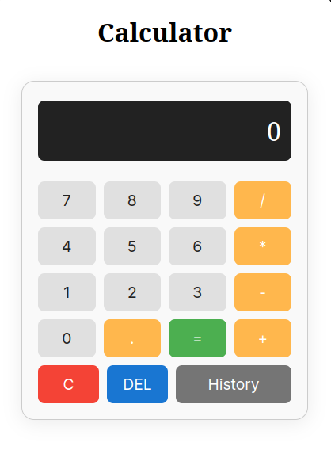

# Project-Calculator

A simple web-based calculator built with HTML, CSS, and JavaScript.

## Features

- Basic arithmetic operations: addition, subtraction, multiplication, division
- Decimal support
- Clear and delete functions
- Calculation history

## Usage

1. Open `index.html` in your web browser.
2. Use the on-screen buttons to perform calculations.
3. Click **History** to view past calculations.

## Files

- `index.html` – Main HTML structure
- `style.css` – Calculator styling
- `script.js` – Calculator logic

## Screenshot

---

Made with ❤️ for learning and practice.